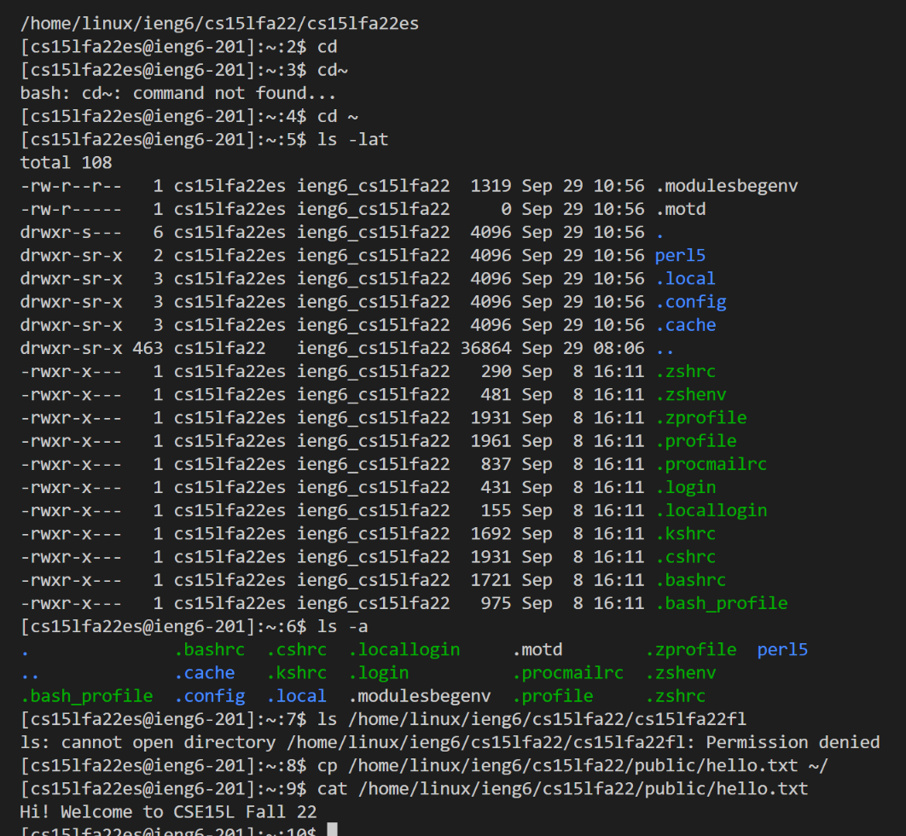

# Login For Course Specific Account 
**Step 1: Installing VScode**
To download VSCode aka Visual Studio Code look it up in the App Store or simply google it and download it from the Visual Studio's website.
I personaly already had it installed. When you pull it up it looks like this:


---
**Step 2: Remotely Connecting**
To remotely connect fallow this  to find your username and then reset your school password.
Wait 15 minuits and then try logging in through your VSCode terminal by putting in ssh and then your username and when it prompts you put 
in your password.


---
**Step 3: Trying Some Commands**
This step is pretty simple, it just there to get you familiae with basic commands. Some examples are
*cd : chage directory
*cat : print the content of file
*scp : copy a file from one server to another
*ls : get a list of the content in the current directory


---
**Step 4: Moving Files with scp**
This is a simple command that requires two arguments the first is the address in the current server where the file is and second the server 
address where it should be tranferred. Note you will need your server password for this command to go through.


---
**Step 5: Setting an SSH Key**
A useful trick is being able to login to a private server without constantly putting in a new password. To do so you must put in 
```
# on client (your computer)
$ ssh-keygen
Generating public/private rsa key pair.
Enter file in which to save the key (/Users/joe/.ssh/id_rsa): /Users/joe/.ssh/id_rsa
Enter passphrase (empty for no passphrase): 
Enter same passphrase again: 
Your identification has been saved in /Users/joe/.ssh/id_rsa.
Your public key has been saved in /Users/joe/.ssh/id_rsa.pub.
The key fingerprint is:
SHA256:jZaZH6fI8E2I1D35hnvGeBePQ4ELOf2Ge+G0XknoXp0 joe@Joes-Mac-mini.local
The key's randomart image is:
+---[RSA 3072]----+
|                 |
|       . . + .   |
|      . . B o .  |
|     . . B * +.. |
|      o S = *.B. |
|       = = O.*.*+|
|        + * *.BE+|
|           +.+.o |
|             ..  |
+----[SHA256]-----+
```
Make sure to put in your address inplace of the one above


---
**Step 6: Optimizing Remote Running**
Last but not least it is tiresome to put in commands one by one. A way to optimize is writting more then one command per line which can be done using ;. Below I use that in order to to shorten 4 lines of commands used to run the moving a file from one server to another and then switch to that server and login into the two fallowing lines of commands.


