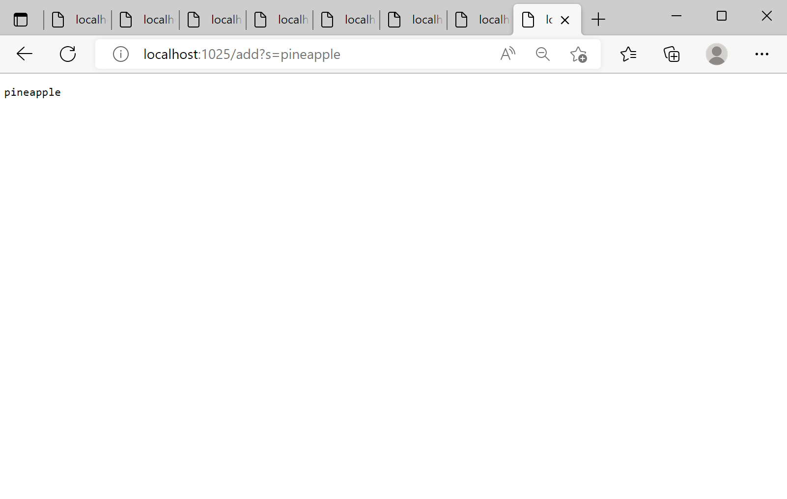
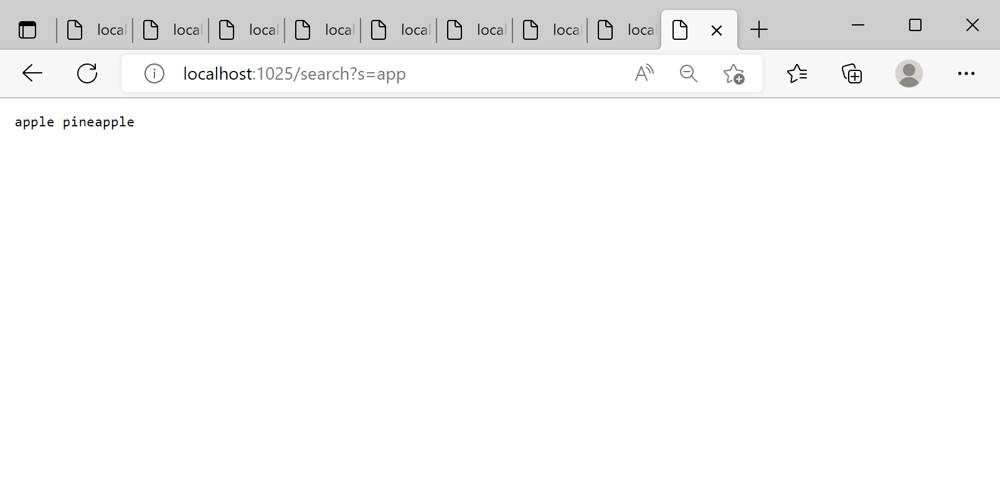

# Lab Report 2
**Part 1**
1. Add apple: 
Which methods in your code are called? 
*My codes main method has called the the default URLHandler constructor and passed in an instance of it to Server classes start method where the handleRequest(URI url)  method gets called.*

---
What the values of the relevant arguments to those methods are, and the values of any relevant fields of the class
*The main method is passed in the port number which it uses to set up the search engine. The start method is passed in the port and an instance of URLHandler were it then calls handleRequest method with the URI. The field variebles I added was the ArraList of strings called adds where the new search apple was added prints*

---
If those values change, how they change by the time the request is done processing
*The adds Arraylist will increase in size by one an now contain the string apple*

---


2. Add pinapple: 
Which methods in your code are called? 
*My codes main method has called the the default URLHandler constructor and passed in an instance of it to Server classes start method where the handleRequest(URI url)  method gets called.*

---
What the values of the relevant arguments to those methods are, and the values of any relevant fields of the class
*The main method is passed in the port number which it uses to set up the search engine. The start method is passed in the port and an instance of URLHandler were it then calls handleRequest method with the URI. The field variebles I added was the ArraList of strings called adds where the new search pinapple was added prints*

---
If those values change, how they change by the time the request is done processing
*The adds Arraylist will increase in size by one an now contain the string pinapple*

---



2. Search app: 
Which methods in your code are called? 
*My codes main method has called the the default URLHandler constructor and passed in an instance of it to Server classes start method where the handleRequest(URI url)  method gets called.*

---
What the values of the relevant arguments to those methods are, and the values of any relevant fields of the class
*The main method is passed in the port number which it uses to set up the search engine. The start method is passed in the port and an instance of URLHandler were it then calls handleRequest method with the URI. The field variebles I added was the ArraList of strings called adds this contains all the prfeviously searched strings and the String object prints which holds all the searches that have the subbstring passed in*

---
If those values change, how they change by the time the request is done processing
*The prints string will increase by concatinating all the relevant passed searches by checking if they contain the substring*

---


---
---
**Step.2**
1. The ArrayExamples file
The failure-inducing input (the code of the test):
```
@Test 
	public void testReversed2() {
    int[] input1 = {1,2,3,4};
    System.out.print(input1);
    assertArrayEquals(new int[]{4,3,2,1},  ArrayExamples.reversed(input1));
	}
```
---

The symptom (the failing test output):
3) testReversed2(ArrayTests)
arrays first differed at element [0]; expected:<4> but was:<0>
        at org.junit.internal.ComparisonCriteria.arrayEquals(ComparisonCriteria.java:78)
        at org.junit.internal.ComparisonCriteria.arrayEquals(ComparisonCriteria.java:28)
        at org.junit.Assert.internalArrayEquals(Assert.java:534)
        at org.junit.Assert.assertArrayEquals(Assert.java:418)
        at org.junit.Assert.assertArrayEquals(Assert.java:429)
        at ArrayTests.testReversed2(ArrayTests.java:28)
        ... 32 trimmed
Caused by: java.lang.AssertionError: expected:<4> but was:<0>
        at org.junit.Assert.fail(Assert.java:89)
        at org.junit.Assert.failNotEquals(Assert.java:835)
        at org.junit.Assert.assertEquals(Assert.java:120)
        at org.junit.Assert.assertEquals(Assert.java:146)
        at org.junit.internal.ExactComparisonCriteria.assertElementsEqual(ExactComparisonCriteria.java:8)
        at org.junit.internal.ComparisonCriteria.arrayEquals(ComparisonCriteria.java:76)
        ... 38 more

FAILURES!!!

---
```
The bug (the code fix needed):   
static int[] reversed(int[] arr) {
    int[] newArray = new int[arr.length];
    for(int i = 0; i < arr.length; i += 1) {
      newArray[arr.length - i - 1] =arr[i];
      System.out.print(newArray[arr.length - i - 1]);
      
    }
    return newArray;
```
    
   
  As you see here newArray with reverse numbers is returned instead of old array arr and the newArray gets assigned to the value of the old array not vise versa.
  
  ---

Then, explain the connection between the symptom and the bug. Why does the bug cause that particular symptom for that particular input?
*The right array wasn't being returned or assigned instead we were getting the empty array. The empty array is only the invese of an empty array and thus we had the bug where the inverse of the array I passed in did not match the one that was returned.*

