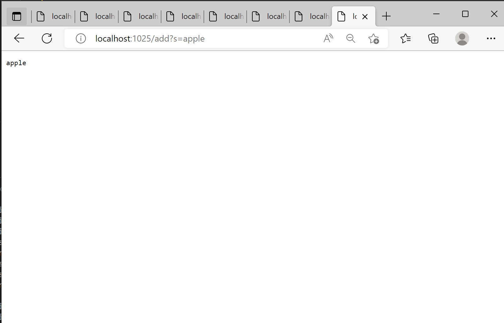

# Lab Report 2
**Part 1**
1. Add apple: 
Which methods in your code are called? 
*My codes main method has called the the default URLHandler constructor and passed in an instance of it to Server classes start method where the handleRequest(URI url)  method gets called.*
What the values of the relevant arguments to those methods are, and the values of any relevant fields of the class
*The main method is passed in the port number which it uses to set up the search engine. The start method is passed in the port and an instance of URLHandler were it then calls handleRequest method with the URI. The field variebles I added was the ArraList of strings called adds where the new search apple was added prints*
If those values change, how they change by the time the request is done processing
*The adds Arraylist will increase in size by one an now contain the string apple*

2. Add pinapple: 
Which methods in your code are called? 
*My codes main method has called the the default URLHandler constructor and passed in an instance of it to Server classes start method where the handleRequest(URI url)  method gets called.*
What the values of the relevant arguments to those methods are, and the values of any relevant fields of the class
*The main method is passed in the port number which it uses to set up the search engine. The start method is passed in the port and an instance of URLHandler were it then calls handleRequest method with the URI. The field variebles I added was the ArraList of strings called adds where the new search pinapple was added prints*
If those values change, how they change by the time the request is done processing
*The adds Arraylist will increase in size by one an now contain the string pinapple*

2. Search app: 
Which methods in your code are called? 
*My codes main method has called the the default URLHandler constructor and passed in an instance of it to Server classes start method where the handleRequest(URI url)  method gets called.*
What the values of the relevant arguments to those methods are, and the values of any relevant fields of the class
*The main method is passed in the port number which it uses to set up the search engine. The start method is passed in the port and an instance of URLHandler were it then calls handleRequest method with the URI. The field variebles I added was the ArraList of strings called adds this contains all the prfeviously searched strings and the String object prints which holds all the searches that have the subbstring passed in*
If those values change, how they change by the time the request is done processing
*The prints string will increase by concatinating all the relevant passed searches by checking if they contain the substring*

