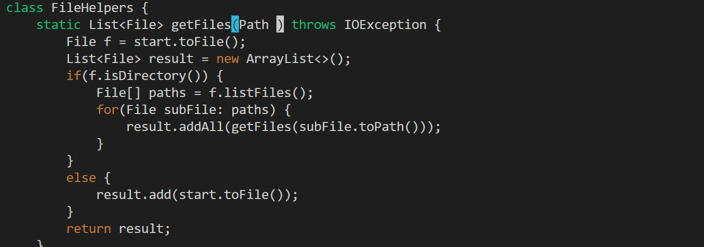

# Part 1 #
```
1. /start
2. <enter>
3. cgn
4. base
5. <escape>
6. n
7. .
8. n
9. .
  
total of 19 keystrokes

/start <enter> takes us to our first instance of start in the code 
  
```


```
cgn where c deletes the specified text and gn highlights the last thing searched which is start and thus start is deletede and vim goes into insert mode
```



```
type in base to fill in where start was

```


```
Then we escape instert mode by pressing the <escape> and find the next instance of start by pressing n

```


```
The . replaces the next instance of start just as we did before because by using cgn we create a presedent on how the searched text should be replaced and we end up in normal mode as before.  

```


```
We once again find the next instance of start by pressing n

```


```
The . replaces the next instance of start just as we did before because by using cgn we create a presedent on how the searched text should be replaced and we end up in normal mode as before.  

```


---


**Part 2**

First way attempt timed: 2 min 3 sec, second attemp 45 seconds. For me the first attempt took longer because I accidently was not scp from the right directory at the beginning. Also since I had a bit of practice with the second approach in part one it was easier to mechanically repeat out of memory. 
1. I personnally still perfer the first way, I think since I am not as comfortable in vim it would under most circumstances take longer and I also find that I often accidently shift between modes and thus an waisting time on errores.
2. I can see how the second approach is more reasonable when you might not have enough storage to always download interfaces such as visula studious and must use the command line to be more memory efficient. 
