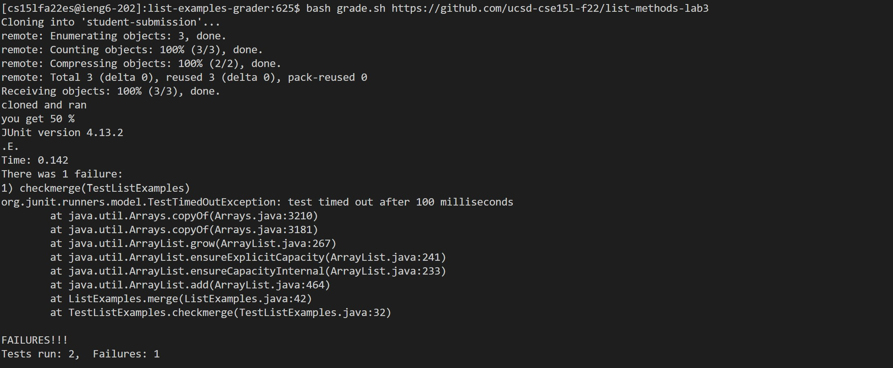
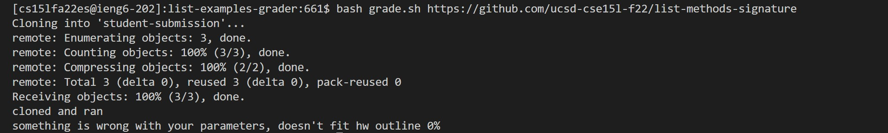
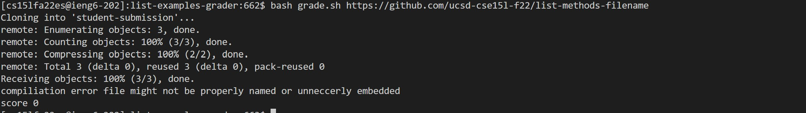

# Lab Report 5 
1. 


2.


3.


---
# Tracing through example 3
grade.sh 
```

rm -rf student-submission 
git clone "$1" student-submission
cp -r  lib student-submission/
cp TestListExamples.java  student-submission/
cd student-submission
if [[ ! -e ListExamples.java ]]

then
   echo "compiliation error file might not be properly named or unneccerly embedded" 
   echo "score 0" 
   exit 1
fi
echo "cloned and ran"
javac ListExamples.java
if [ $? -ne 0 ]
then
  echo "could not compile your ListExamples"
  echo "score 0"
     exit 1
fi
javac -cp .:../lib/hamcrest-core-1.3.jar:../lib/junit-4.13.2.jar *.java > error3.txt 2> error4.txt
java  -cp .:../lib/hamcrest-core-1.3.jar:../lib/junit-4.13.2.jar  org.junit.runner.JUnitCore TestListExamples 2> error.txt > error2.txt
if [ $(grep -c "Tests run: 1,"  error2.txt)  -ne 0 ]
        then
                echo "something is wrong with your parameters, doesn't fit hw outline 0%"
               exit 1
        fi

if [ $(grep -c "Failures: 1"  error2.txt)  -ne 0 ]
        then
                echo you get 50 %
                cat error2.txt
                exit 1
        fi
if [ $(grep -c "Failures: 2" error2.txt)  -ne 0 ]
         then
                 echo you get 0 %
                 cat error2.txt
                exit 1
       fi

echo "100% good job"

```
Standard output | Standard error | Exit code 
1. rm -rf student-submission
Standard output | Standard error | Exit code : N/A|N/A|0
2. git clone "$1" student-submission
Standard output | Standard error | Exit code : N/A|Cloning into 'student-submission'...|0
3.cp -r  lib student-submission/
Standard output | Standard error | Exit code : N/A|N/A|0
4.cp TestListExamples.java  student-submission/
Standard output | Standard error | Exit code : N/A|N/A|0
5.cd student-submission
Standard output | Standard error | Exit code : N/A|N/A|0
6.if [[ ! -e ListExamples.java ]]
This if statement is true because the file is called ListMethods.java intstead of ListExamples.java 
Standard output | Standard error | Exit code : N/A|N/A|0
7. then                                                                                                                                                                  Standard output | Standard error | Exit code : N/A|N/A|0
8.echo "compiliation error file might not be properly named or unneccerly embedded" 
Standard output | Standard error | Exit code : N/A|N/A|0
9.echo "score 0"
Standard output | Standard error | Exit code : N/A|N/A|0
10.exit 1 
Standard output | Standard error | Exit code : N/A|N/A|0

 
